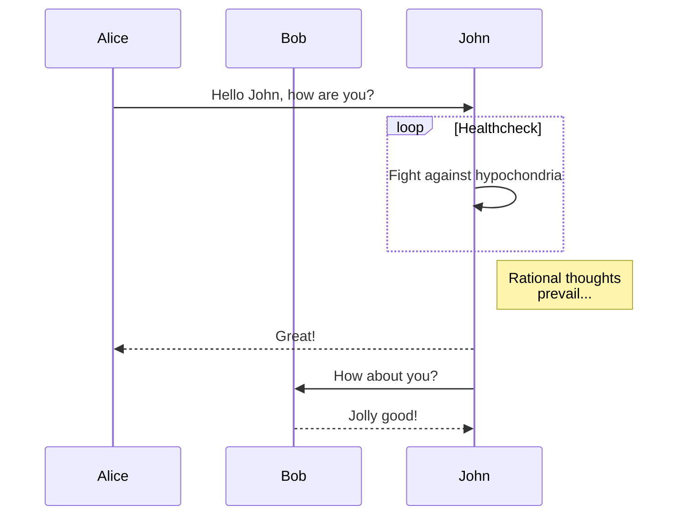

# 测试标题

## 测试二级标题

### 测试三级标题

#### 测试四级标题

- 测试无序列表1
- 测试无序列表2

1. 测试有序列表1
2. 测试有序列表2

- 测试嵌套
    1. 测试嵌套第二次
        - 测试嵌套第三层


> 测试引用

测试表格

| 标题1 | 标题2 | 标题3 |
| ----- | ---- | ---- |
| 文本1 | 文本2 | 文本3 |
| 文本4 | 文本5 | 文本6 |

**这是加粗的文字**  
*这是倾斜的文字*  
***这是斜体加粗的文字***  
~~这是加删除线的文字~~


[测试超链接](https://github.com/JabinGP/mdout)

`测试代码段高亮`

测试代码块高亮

    package main

    import (
        "fmt"
    )

    func main() {
        fmt.Println("Hello Mdout")
    }

```c
#include <stdio.h>

int main(){
    print("Hello world.");
    return 0;
}
```

测试 MathJax

这是一个行中公式$\frac{n!}{k!(n-k)!} = \\\\binom{n}{k}$行中公式

$$
\\\\frac{n!}{k!(n-k)!} = \\\\binom{n}{k}
$$

测试 mermaid


